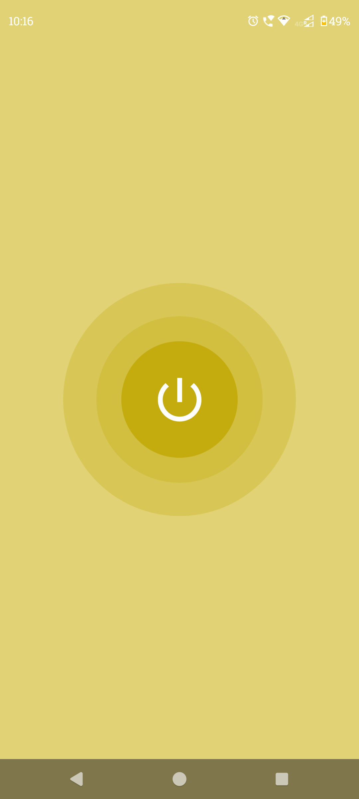

# Flashlight-App
A simple Flashlight (Torch) App made for Android Devices with Kotlin and Jetpack Compose

A minimalist yet functional **Flashlight App** built using **Kotlin** and **Jetpack Compose**. This app allows you to control your flashlight and turn it on/off.

#### Download on:
<a href = https://github.com/Govind-Sankar/Flashlight-App/releases>

</a>

## 📱 Features

- Turn flashlight On or Off
- Modern minimalist UI using Jetpack Compose
- Simple and clean design

## 🖼️ Screenshots

  

## 📦 How to Install

1. Download the latest APK from the [Releases](https://github.com/Govind-Sankar/Flashlight-App/releases) section.
2. Transfer the APK to your Android device.
3. Enable installation from unknown sources.
4. Open the APK and install it.

## 🚀 Getting Started (for developers)

Clone this repo:
   ```bash
   git clone https://github.com/Govind-Sankar/Flashlight-App.git
   ```

## 📄 License

This project is licensed under the [MIT License](LICENSE).

Feel free to use, modify, and distribute it. See the LICENSE file for details.
